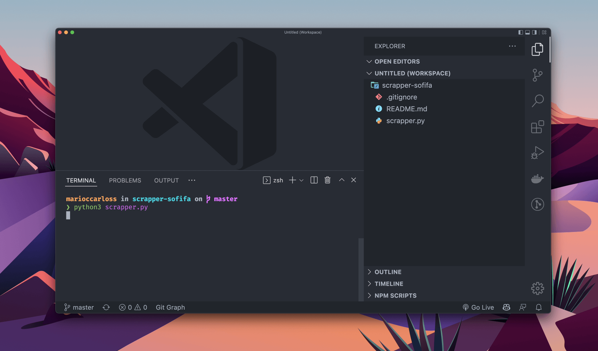
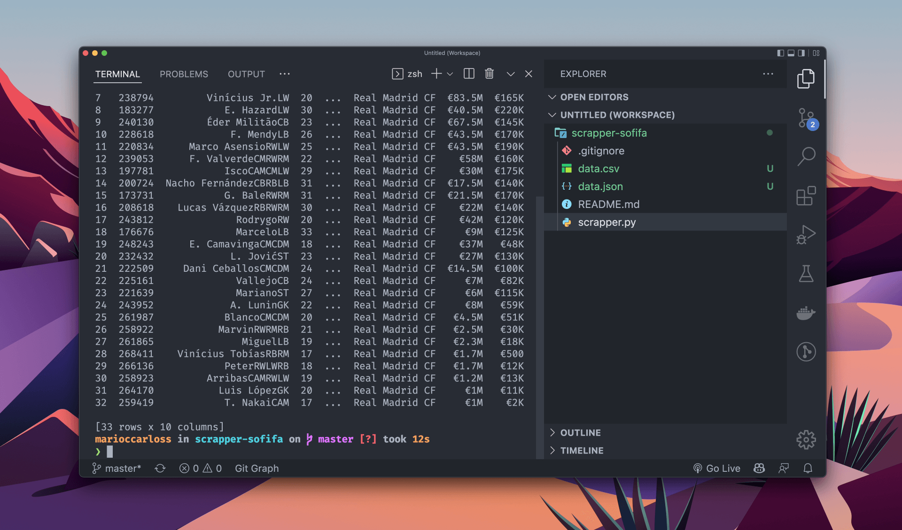

# sofifa-scrapper-python

This app is a alternative solution to missing api in sofifa.com to get teams and players information.

## Requeriments

```bash

python3 --version
# Python 3.10.4 or more recent
```

## Installation

```bash

# install pandas
pip3 install pandas

# install requests
pip3 install requests

# install BeautifulSoup
pip3 install beautifulsoup4
```
## Run
```bash

# run the app
python3 scrapper.py
```

## Run app



## Result

`Generate a csv file with some teams and players information and export to a json file`

